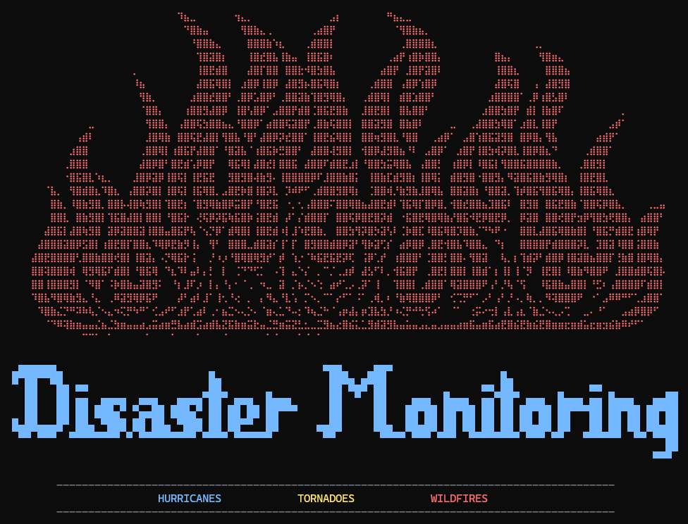

# Natural Disaster Distance Monitor

> **Track hurricanes, tornadoes, and wildfires near any location in real-time.**

A CLI tool that queries public government APIs (NOAA, WFIGS) to find active natural disasters within a specified radius of your location.



## Features

- 🌀 **Hurricane Tracking** - Active storms from NOAA/National Hurricane Center
- 🌪️ **Tornado Reports** - Recent tornado damage assessments  
- 🔥 **Wildfire Perimeters** - Active fire boundaries from WFIGS
- 📍 **Distance Calculation** - Accurate haversine distance to each disaster
- 🎨 **Interactive Mode** - Beautiful colored CLI with arrow-key navigation
- 📄 **Batch Processing** - Query multiple locations via CSV file
- 📊 **JSON Output** - Machine-readable output for scripting

## Quick Start

### Installation

```bash
cd python
pip install -r requirements.txt
```

### Interactive Mode (Recommended)

Simply run without arguments for a guided experience:

```bash
python main.py
```

This launches an interactive session with:
- Coordinate input with validation
- Multi-select disaster type menu
- Radius selection
- Formatted results tables

### Command Line Mode

```bash
# Single location
python main.py --lat 29.7604 --lon -95.3698 --name "Houston TX"

# With custom radius (default: 100 miles)
python main.py --lat 34.0522 --lon -118.2437 --radius 50

# Filter by disaster type
python main.py --lat 29.7604 --lon -95.3698 --type wildfires

# Batch query from CSV
python main.py --csv ../shared/data/test_locations.csv

# JSON output
python main.py --lat 29.7604 --lon -95.3698 --json
```

## CLI Options

| Option | Description |
|--------|-------------|
| `--lat FLOAT` | Latitude in decimal degrees |
| `--lon FLOAT` | Longitude in decimal degrees |
| `--name STRING` | Location name (optional) |
| `--csv FILE` | CSV file with locations |
| `--radius FLOAT` | Search radius in miles (default: 100) |
| `--type TYPE` | Filter: `hurricanes`, `tornadoes`, `wildfires` |
| `--json` | Output as JSON |
| `--interactive`, `-i` | Launch interactive mode |

## Data Sources

| Disaster | Provider | Update Frequency |
|----------|----------|------------------|
| Hurricanes | NOAA/NHC ArcGIS | Every 6 hours |
| Tornadoes | NOAA Damage Assessment Toolkit | As reported |
| Wildfires | WFIGS Interagency | Daily |

## Project Structure

```
natural-disaster-distance-monitor/
├── python/                      # Python implementation
│   ├── main.py                  # CLI entry point
│   ├── interactive.py           # Interactive CLI module
│   ├── requirements.txt
│   └── disasters/               # Core library
│       ├── hurricanes.py
│       ├── tornadoes.py
│       ├── wildfires.py
│       └── utils.py
│
├── shared/                      # Shared resources
│   ├── data/test_locations.csv  # Sample test data
│   └── specs/                   # API & model specs
│
└── rust/                        # Rust implementation (planned)
```

## Requirements

- Python 3.10+
- Dependencies: `requests`, `pandas`, `numpy`, `rich`, `questionary`

## Example Output

```
📍 Houston TX (29.7604, -95.3698)
Search radius: 100 miles

🌀 HURRICANES (1 found)
┌──────────────────┬──────────┬──────────┬─────────┬─────────────┐
│ Name             │ Distance │ Category │ Wind    │ Status      │
├──────────────────┼──────────┼──────────┼─────────┼─────────────┤
│ Hurricane Milton │  45.2 mi │ Cat 2    │ 100 mph │ ⚠️ INSIDE   │
└──────────────────┴──────────┴──────────┴─────────┴─────────────┘

🌪️ No recent tornadoes within search radius

🔥 No active wildfires within search radius

⚡ 1 TOTAL DISASTERS WITHIN 100 MILES
```

## License

MIT License
